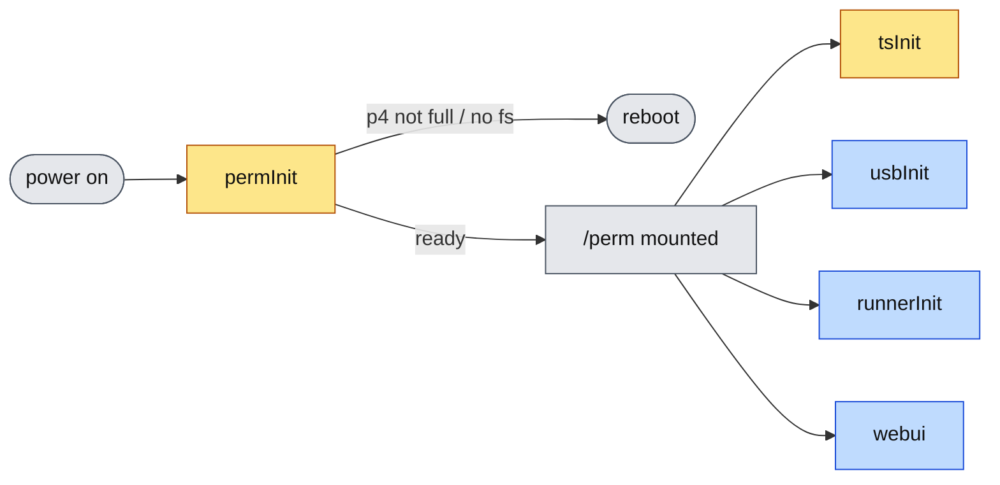
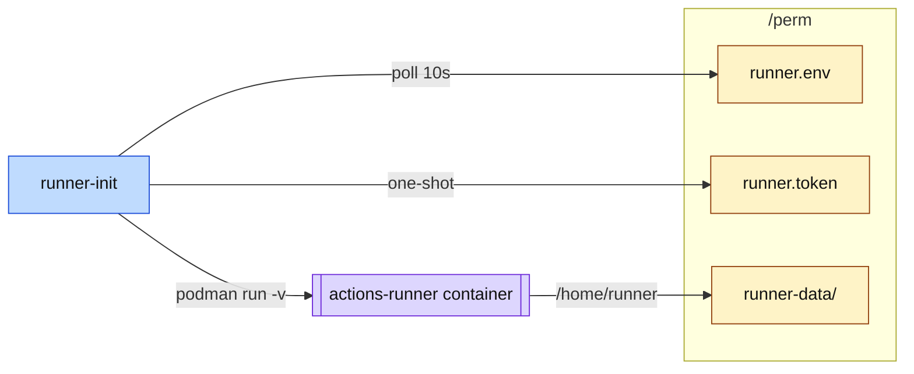
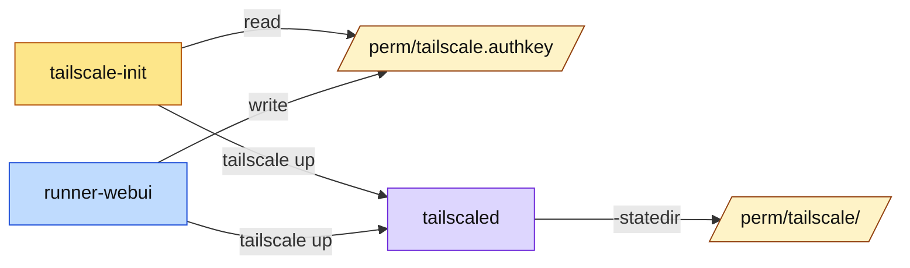

# gokrazy-runner

A [gokrazy](https://gokrazy.org) appliance image that boots straight into a
GitHub Actions self-hosted runner.

The runner itself is the official `actions/runner` (.NET, glibc-based), so it
runs inside the upstream `ghcr.io/actions/actions-runner` container — gokrazy
provides a minimal Go userspace, the container provides the runner's runtime
dependencies. A small Go init binary (`runner-init`) reads configuration
from `/perm`, pulls the container image, and supervises it (driving
`config.sh` once for registration, then `run.sh` for every boot).

Designed for **Raspberry Pi 4 / arm64**. Other arm64 SBCs work with a
different kernel package set.

## Architecture

### Boot sequence



`perm-init` and `tailscale-init` are one-shot (yellow); `usbdev-init`,
`runner-init`, and `runner-webui` are long-lived supervisors (blue).

### Runner data plane



### Web UI & OTA


### Tailscale



The official `ghcr.io/actions/actions-runner` image only ships the runner
itself — no docker, no language toolchains. Your workflows install whatever
they need at job time, or you can override `IMAGE=` in `/perm/runner.env`
with a derivative image that bakes more tools in.

## Repository layout

```
cmd/perm-init/        one-shot service: grow + format /perm on first boot
cmd/runner-init/      runs the GitHub runner container under podman
cmd/runner-webui/     HTTPS web UI for runner config + OTA
cmd/tailscale-init/   one-shot: tailscale up using /perm/tailscale.authkey
cmd/usbdev-init/      udev stand-in: mknods /dev/bus/usb/BBB/DDD from sysfs
pkg/dnsfallback/      seeds /tmp/resolv.conf when DHCP supplies no DNS
pkg/perminit/         GPT/partition helpers shared by perm-init
scripts/
  gok-packages.txt    canonical list of gokrazy packages
  gok-common.sh       shell helper sourced by setup + build scripts
  build-ota-image.sh  CI / OTA image builder
setup-gokrazy.sh      interactive local SD-card provisioning
.github/workflows/    CI + OTA image build
```

## Building an image locally

Prerequisites: `gok` CLI (`go install github.com/gokrazy/tools/cmd/gok@latest`)
and a static arm64 `mke2fs` binary on `$PATH` (or pointed at via
`MKE2FS_BINARY`).

```bash
# Provision a local instance
./setup-gokrazy.sh

# Initial flash (BE CAREFUL with the device path)
gok -i gokrazy-runner overwrite --full /dev/sdX

# Subsequent OTA updates
gok -i gokrazy-runner overwrite --update yes
```

## CI image builds

Every push to `master` triggers `.github/workflows/ota-image.yml`, which:

1. Runs `go vet` and `go test` on `ubuntu-latest`.
2. On `ubuntu-24.04-arm`, builds two artifacts via `make ota`:
   - `gokrazy-runner-rpi4b.img` — full flash image (initial SD card flash)
   - `gokrazy-runner-rpi4b-root.squashfs` — OTA root for `gok overwrite --update`
3. Compresses both with `gzip -9`, attests provenance, and publishes to a
   GitHub Release tagged `master-${SHA}` (prerelease) or `${TAG_NAME}` for
   tags.

## Configuring a runner

The easiest path is the **Web UI** (see below). If you'd rather provision
by hand, write the following to `/perm` via breakglass SSH:

```bash
# /perm/runner.env
URL=https://github.com/<owner>/<repo>      # or https://github.com/<org>
NAME=my-pi4-runner
LABELS=self-hosted,linux,arm64,gokrazy
# Optional override:
# IMAGE=ghcr.io/actions/actions-runner:2.319.0  # pin to a specific version
```

```bash
# /perm/runner.token  (chmod 0600)
<one-shot registration token from GitHub Settings → Actions → Runners → New runner>
```

`runner-init` polls `/perm/runner.env` every 10s, so it will pick up the
new files within seconds — no reboot needed. The runner's `_work` directory
and registered identity persist in `/perm/runner-data` across reboots, so
the registration token only needs to be supplied once.

## Tailscale

The image bakes in upstream `tailscale.com/cmd/tailscaled` and
`tailscale.com/cmd/tailscale`. tailscaled persists its state under
`/perm/tailscale/` (configured at the package level via `-statedir`), so the
device stays authenticated across reboots.

To register a new device, write a Tailscale auth key to
`/perm/tailscale.authkey` (`chmod 0600`). The auth key lives at the
`/perm/` root rather than inside `/perm/tailscale/` because gokrazy
bind-mounts tailscaled's `-statedir` read-only into other services'
namespaces, which would block the web UI from writing there.

On every boot, the one-shot `tailscale-init` service reads that file
and runs:

```
/user/tailscale up --auth-key=… --hostname=$TS_HOSTNAME --ssh
```

Use a reusable auth key if you want re-auth to keep working after a wipe; a
single-use key works fine the first time, after which the persisted state in
`/perm/tailscale/` keeps the node connected without the key.

The Web UI's **Tailscale** section accepts an auth key, validates the
`tskey-auth-` prefix, persists it to `/perm/tailscale/authkey`, and runs
`tailscale up` immediately so the device joins the tailnet without waiting
for a reboot.

Tunables (set in the `cmd/tailscale-init` PackageConfig `Environment`):

- `TS_AUTH_KEY_PATH` — auth key file (default `/perm/tailscale.authkey`)
- `TS_HOSTNAME` — `--hostname` value (default the gokrazy instance name)
- `TS_TAILSCALE_UP_ARGS` — extra args appended to `tailscale up` (default `--ssh`)

## Web UI

A small HTTP service (`cmd/runner-webui`) serves an embedded HTML/JS UI
for everything an operator normally edits under `/perm`. It listens on
`:8443` over HTTPS using the **per-device** self-signed certificate at
`/perm/ssl/gokrazy-web.{pem,key.pem}` that gokrazy itself generates on
first boot (driven by `Update.TLSCertificateStorage = "perm-self-signed"`
in `config.json`). The same cert is served by `/update/` on `:443`, so
both endpoints present the same identity and it survives OTA updates.
runner-webui only consumes this file — it never writes to it. The
server falls back to plain HTTP on `:8080` if the cert isn't readable
yet (or if `WEBUI_LISTEN_HTTP_ONLY` is set). Once the device is online,
point a browser at `https://<device>:8443/`.

- **Credentials**: HTTP Basic. The UI password *is* the gokrazy update
  password — the same one you would type at `https://<device>/update/`.
  It is read from `/perm/gokr-pw.txt`, falling back to the rootfs-baked
  `/etc/gokr-pw.txt`, and finally to the literal default `gokrazy-runner`
  if neither file exists. Changing the password from the UI rewrites
  `/perm/gokr-pw.txt`, so `/update/` and the UI stay in sync.
- **What you can edit**: the runner's `URL`, `NAME`, `LABELS`, `IMAGE`,
  and arbitrary extra `KEY=VALUE` env entries (writes `/perm/runner.env`);
  the one-shot GitHub registration token (`/perm/runner.token`); the
  breakglass `authorized_keys`. There is also a reboot button.
- **Status endpoint** (`GET /api/status`) reports whether a token has
  been written, whether `/perm/runner-data` is populated, the binary
  version, and whether the password is still the literal default —
  handy for a smoke check after first boot.
- **Support logs** (`GET /api/support`): returns a single text/plain
  diagnostics bundle (network state, `/etc/resolv.conf`, container logs,
  recent kernel messages, redacted `runner.env`, `tailscale status`, …).
  The **System** card has a *Copy support logs* / *Download* button that
  fetches it. Tokens, passwords, and the Tailscale auth key are never
  included; sensitive-looking env values (`*_TOKEN`, `*_KEY`, …) are
  replaced with `**redacted (N bytes)**` before being shown.
- **Software update**: the **Software Update** card lists every GitHub
  release that ships an OTA squashfs and lets you install one with a
  single click. The selected release is downloaded (gzipped squashfs),
  streamed into the loopback gokrazy updater
  (`http://gokrazy:<pw>@127.0.0.1/update/root`), the partitions are
  switched, and the device reboots. Progress (download speed, percent,
  current phase) is shown live; install history persists at
  `/perm/ota-install-history.json`. Endpoints: `GET /api/ota/status`,
  `POST /api/ota/install` (`{"release_tag":"…"}`; omit or set to
  `"latest"` for the most recent release).

The Web UI and the manual `/perm` flow are interchangeable: `runner-init`
re-reads the same files either way. Pick whichever is convenient — most
people will use the UI for day-to-day changes and `scp` only for headless
provisioning.

## Conventions

- **Branches**: `type/what` (`feature/foo`, `fix/bar`); no feature branches
  unless requested.
- **Commits**: conventional commits (`feat(runner): ...`,
  `fix(perm-init): ...`).
- **CI gate**: every push must keep CI green.
