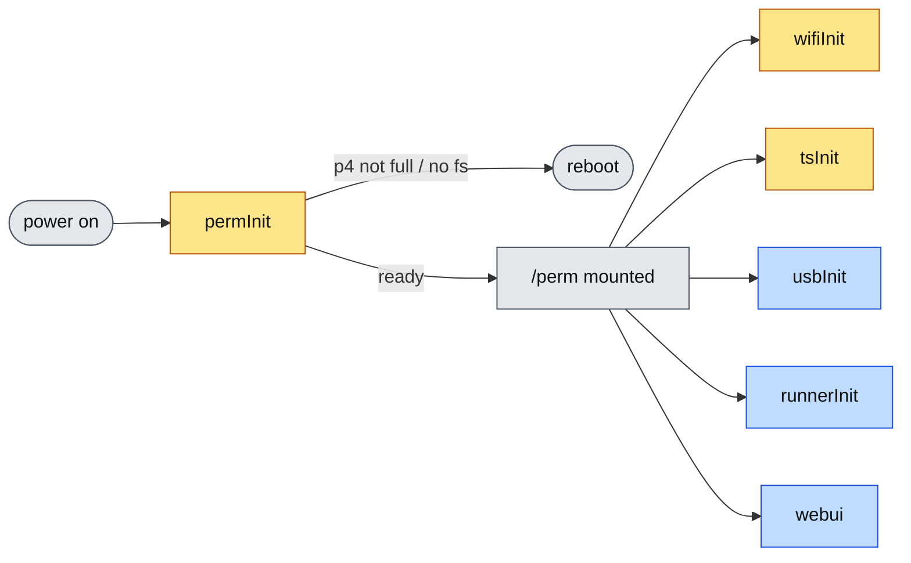
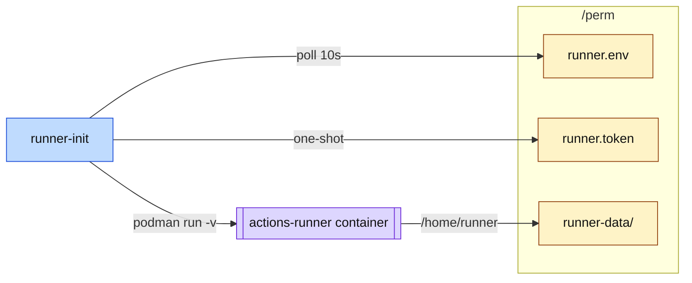
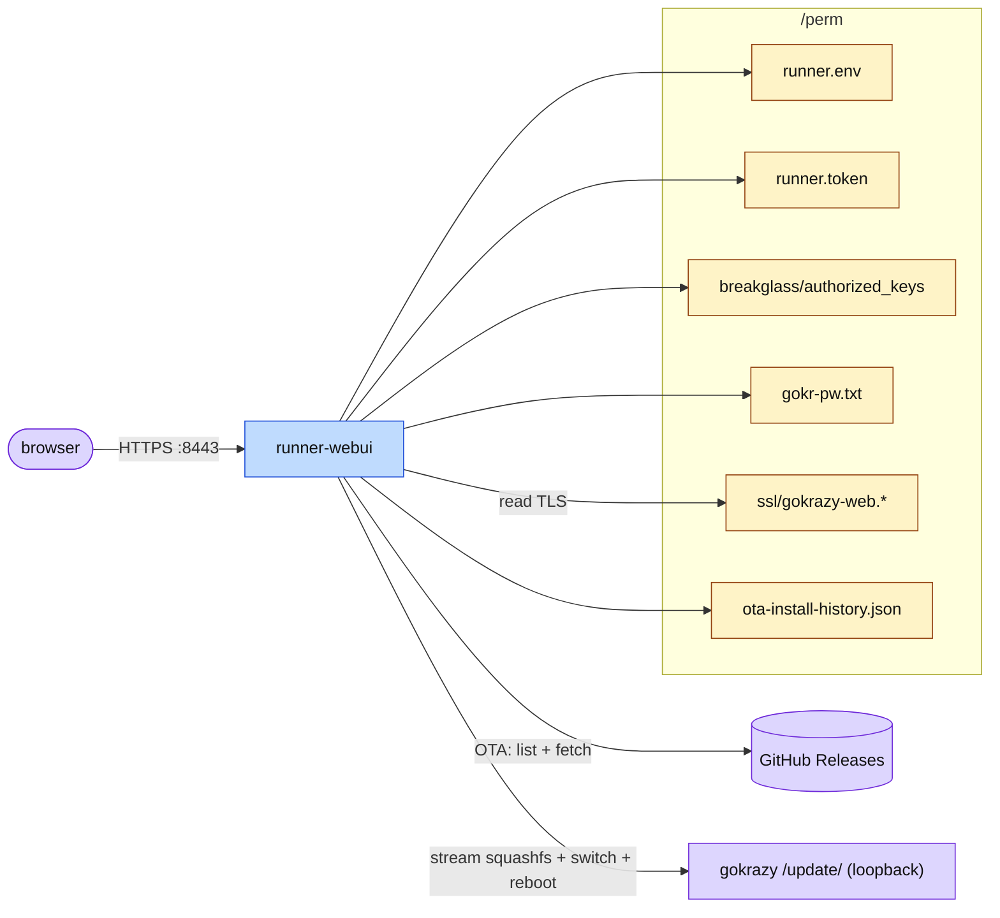
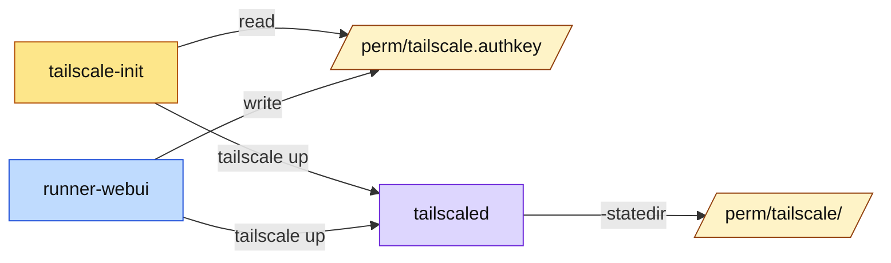

# gokrazy-runner

A [gokrazy](https://gokrazy.org) appliance image that boots straight into a
GitHub Actions self-hosted runner.

The runner itself is the official `actions/runner` (.NET, glibc-based), so it
runs inside the upstream `ghcr.io/actions/actions-runner` container — gokrazy
provides a minimal Go userspace, the container provides the runner's runtime
dependencies. A small Go init binary (`runner-init`) reads configuration
from `/perm`, pulls the container image, and supervises it (driving
`config.sh` once for registration, then `run.sh` for every boot).

Designed for **Raspberry Pi 4 / arm64**. Other arm64 SBCs work with a
different kernel package set.

## Architecture

### Boot sequence



`perm-init`, `wifi-init`, and `tailscale-init` are one-shot (yellow);
`usbdev-init`,
`runner-init`, and `runner-webui` are long-lived supervisors (blue).

### Runner data plane



### Web UI & OTA



### Tailscale



The official `ghcr.io/actions/actions-runner` image only ships the runner
itself — no docker, no language toolchains. Your workflows install whatever
they need at job time, or you can override `IMAGE=` in `/perm/runner.env`
with a derivative image that bakes more tools in.

## Repository layout

```
cmd/perm-init/        one-shot service: grow + format /perm on first boot
cmd/runner-init/      runs the GitHub runner container under podman
cmd/runner-webui/     HTTPS web UI for runner config + OTA
cmd/tailscale-init/   one-shot: tailscale up using /perm/tailscale.authkey
cmd/wifi-init/        one-shot: load the Wi-Fi driver, then exec gokrazy's wifi
cmd/usbdev-init/      udev stand-in: mknods /dev/bus/usb/BBB/DDD from sysfs
pkg/dnsfallback/      seeds /tmp/resolv.conf when DHCP supplies no DNS
pkg/perminit/         GPT/partition helpers shared by perm-init
pkg/wifimanager/      Wi-Fi scanning (nl80211) + saved networks in /perm
scripts/
  gok-packages.txt    canonical list of gokrazy packages
  gok-common.sh       shell helper sourced by setup + build scripts
  build-ota-image.sh  CI / OTA image builder
setup-gokrazy.sh      interactive local SD-card provisioning
.github/workflows/    CI + OTA image build
```

## Building an image locally

Prerequisites: `gok` CLI (`go install github.com/gokrazy/tools/cmd/gok@latest`)
and a static arm64 `mke2fs` binary on `$PATH` (or pointed at via
`MKE2FS_BINARY`).

```bash
# Provision a local instance
./setup-gokrazy.sh

# Initial flash (BE CAREFUL with the device path)
gok -i gokrazy-runner overwrite --full /dev/sdX

# Subsequent OTA updates
gok -i gokrazy-runner overwrite --update yes
```

## CI image builds

Every push to `master` triggers `.github/workflows/ota-image.yml`, which:

1. Runs `go vet` and `go test` on `ubuntu-latest`.
2. On `ubuntu-24.04-arm`, builds two artifacts via `make ota`:
   - `gokrazy-runner-rpi4b.img` — full flash image (initial SD card flash)
   - `gokrazy-runner-rpi4b-root.squashfs` — OTA root for `gok overwrite --update`
3. Compresses both with `gzip -9`, attests provenance, and publishes to a
   GitHub Release tagged `master-${SHA}` (prerelease) or `${TAG_NAME}` for
   tags.

## Configuring a runner

The easiest path is the **Web UI** (see below). If you'd rather provision
by hand, write the following to `/perm` via breakglass SSH:

```bash
# /perm/runner.env
URL=https://github.com/<owner>/<repo>      # or https://github.com/<org>
NAME=my-pi4-runner
LABELS=self-hosted,linux,arm64,gokrazy
# Optional override:
# IMAGE=ghcr.io/actions/actions-runner:2.319.0  # pin to a specific version
```

```bash
# /perm/runner.token  (chmod 0600)
<one-shot registration token from GitHub Settings → Actions → Runners → New runner>
```

`runner-init` polls `/perm/runner.env` every 10s, so it will pick up the
new files within seconds — no reboot needed. The runner's `_work` directory
and registered identity persist in `/perm/runner-data` across reboots, so
the registration token only needs to be supplied once.

## Wi-Fi

On every boot the `wifi-init` service brings the radio up
**unconditionally**, even on a device that is on Ethernet with no network
saved. That is what makes the web UI's *Scan* button work: you reach the UI
over Ethernet, so the radio has to be live before you can pick a network.
It:

1. loads `brcmutil` + `brcmfmac` (gokrazy has no modprobe, so the Raspberry
   Pi 4's on-board radio never appears otherwise),
2. brings `wlan0` administratively **up** — nl80211 refuses to scan on a
   down interface, and that is how it comes up after `finit_module`,
3. sets the regulatory domain — without it the kernel uses the
   world-roaming domain and most 5 GHz channels are unusable, and
4. disables Wi-Fi power save (brcmfmac defaults to on, which makes the
   device silently unreachable from the LAN after idle periods).

It then **supervises** `/user/wifi`, the stock `github.com/gokrazy/wifi`
client, for as long as `/perm/wifi.json` names a network — restarting it
with `5s..2min` backoff and polling every 10s, so a network saved from the
web UI associates without a reboot.

Pick a network from the **Wi-Fi** card in the web UI: *Scan for networks*
lists what the radio can see (SSID, signal, whether it is encrypted, and
whether you already have it saved), and *Save & Connect* stores the
credentials. Saving writes two files:

- `/perm/extra-wifi.json` — every network you have saved, in priority order
- `/perm/wifi.json` — the highest-priority network only, in the single-object
  format `github.com/gokrazy/wifi` reads

Both are `chmod 0600` and written atomically. Forgetting the last saved
network removes `/perm/wifi.json` so the device stops retrying it.

To provision headlessly instead, write `/perm/wifi.json` by hand:

```json
{"ssid": "MyNetwork", "psk": "my-passphrase"}
```

Tunables (set in the `cmd/wifi-init` PackageConfig `Environment`):

- `WIFI_COUNTRY` — ISO 3166-1 alpha-2 regulatory domain (default `CH`;
  `setup-gokrazy.sh` prompts for it)
- `WIFI_INIT_INTERFACE` — Wi-Fi interface (default `wlan0`)
- `WIFI_INIT_TIMEOUT` — how long to wait for the interface (default `15s`)
- `WIFI_INIT_ETHERNET_FIRST` — don't *associate* while a cable is present
  (default `false`). The radio is brought up for scanning either way; this
  only suppresses the Wi-Fi client.
- `WIFI_INIT_ETHERNET_INTERFACE` — carrier to check (default `eth0`)
- `WIFI_INIT_CONFIG_PATH` — network config to watch (default
  `/perm/wifi.json`)
- `WIFI_INIT_WIFI_COMMAND` — Wi-Fi client to run (default `/user/wifi`;
  set empty to bring the radio up without associating)

If the UI reports **"No Wi-Fi radio detected"**, the driver never bound:
check the `wifi-init` logs (the *Runner → Logs → kernel* view, or the
support bundle) for a `load brcmfmac` failure.

## Tailscale

The image bakes in upstream `tailscale.com/cmd/tailscaled` and
`tailscale.com/cmd/tailscale`. tailscaled persists its state under
`/perm/tailscale/` (configured at the package level via `-statedir`), so the
device stays authenticated across reboots.

To register a new device, write a Tailscale auth key to
`/perm/tailscale.authkey` (`chmod 0600`). The auth key lives at the
`/perm/` root rather than inside `/perm/tailscale/` because gokrazy
bind-mounts tailscaled's `-statedir` read-only into other services'
namespaces, which would block the web UI from writing there.

On every boot, the one-shot `tailscale-init` service reads that file
and runs:

```
/user/tailscale up --auth-key=… --hostname=$TS_HOSTNAME --ssh
```

Use a reusable auth key if you want re-auth to keep working after a wipe; a
single-use key works fine the first time, after which the persisted state in
`/perm/tailscale/` keeps the node connected without the key.

The Web UI's **Tailscale** section accepts an auth key, validates the
`tskey-auth-` prefix, persists it to `/perm/tailscale/authkey`, and runs
`tailscale up` immediately so the device joins the tailnet without waiting
for a reboot.

Tunables (set in the `cmd/tailscale-init` PackageConfig `Environment`):

- `TS_AUTH_KEY_PATH` — auth key file (default `/perm/tailscale.authkey`)
- `TS_HOSTNAME` — `--hostname` value (default the gokrazy instance name)
- `TS_TAILSCALE_UP_ARGS` — extra args appended to `tailscale up` (default `--ssh`)

## Web UI

A small HTTP service (`cmd/runner-webui`) serves an embedded HTML/JS UI
for everything an operator normally edits under `/perm`. It listens on
`:8443` over HTTPS using the **per-device** self-signed certificate at
`/perm/ssl/gokrazy-web.{pem,key.pem}` that gokrazy itself generates on
first boot (driven by `Update.TLSCertificateStorage = "perm-self-signed"`
in `config.json`). The same cert is served by `/update/` on `:443`, so
both endpoints present the same identity and it survives OTA updates.
runner-webui only consumes this file — it never writes to it. The
server falls back to plain HTTP on `:8080` if the cert isn't readable
yet (or if `WEBUI_LISTEN_HTTP_ONLY` is set). Once the device is online,
point a browser at `https://<device>:8443/`.

- **Credentials**: HTTP Basic. The UI password *is* the gokrazy update
  password — the same one you would type at `https://<device>/update/`.
  It is read from `/perm/gokr-pw.txt`, falling back to the rootfs-baked
  `/etc/gokr-pw.txt`, and finally to the literal default `gokrazy-runner`
  if neither file exists. Changing the password from the UI rewrites
  `/perm/gokr-pw.txt`, so `/update/` and the UI stay in sync.
- **Wi-Fi**: scan for nearby networks, save credentials, and forget saved
  networks. `GET /api/wifi/status` reports the current association and the
  saved list (SSIDs only — a PSK is never returned, even to an
  authenticated caller); `POST /api/wifi/scan` triggers a scan
  (`?sort=signal|name|security`, default signal); `POST /api/wifi/connect`
  (`{"ssid":"…","password":"…"}`) saves and activates a network;
  `POST /api/wifi/forget` (`{"ssid":"…"}`) removes one; `POST
  /api/wifi/reorder` (`{"ssids":[…]}`) changes priority. All five return
  503 when the device has no radio.
- **What you can edit**: the runner's `URL`, `NAME`, `LABELS`, `IMAGE`,
  and arbitrary extra `KEY=VALUE` env entries (writes `/perm/runner.env`);
  the one-shot GitHub registration token (`/perm/runner.token`); the
  breakglass `authorized_keys`. There is also a reboot button.
- **Layout**: four tabs — **Overview** (live device + runner status),
  **Runner** (configuration, registration token, log viewer), **Network**
  (Wi-Fi, Tailscale, interfaces), and **System** (updates, SSH keys,
  password, reboot, support logs). The tab is kept in the URL fragment, so
  `https://<device>:8443/#network` links straight to the Wi-Fi card.
- **Overview** polls `GET /api/system` every 10s (paused while the browser
  tab is hidden) and shows the runner container state, uptime, load
  average, CPU temperature, memory, and free space on `/` and `/perm`,
  with the temperature and usage meters turning amber/red as they approach
  throttling or a full disk. It also lists every non-loopback interface
  with its addresses and link state. **Restart container** force-removes
  the runner container (`POST /api/runner/restart`); runner-init starts a
  fresh one within its backoff window.
- **Log viewer** (`GET /api/logs?source=runner|kernel&lines=N`, max 2000
  lines): tails the runner container log or the kernel ring buffer, with
  an auto-refresh toggle (5s, and only while the Runner tab is open) and a
  copy button.
- **Status endpoint** (`GET /api/status`) reports whether a token has
  been written, whether `/perm/runner-data` is populated, the binary
  version, and whether the password is still the literal default —
  handy for a smoke check after first boot.
- **Support logs** (`GET /api/support`): returns a single text/plain
  diagnostics bundle (network state, `/etc/resolv.conf`, container logs,
  recent kernel messages, redacted `runner.env`, `tailscale status`, …).
  The **System** card has a *Copy support logs* / *Download* button that
  fetches it. Tokens, passwords, and the Tailscale auth key are never
  included; sensitive-looking env values (`*_TOKEN`, `*_KEY`, …) are
  replaced with `**redacted (N bytes)**` before being shown.
- **Software update**: the **Software Update** card lists every GitHub
  release that ships an OTA squashfs and lets you install one with a
  single click. The selected release is downloaded (gzipped squashfs),
  streamed into the loopback gokrazy updater
  (`http://gokrazy:<pw>@127.0.0.1/update/root`), the partitions are
  switched, and the device reboots. Progress (download speed, percent,
  current phase) is shown live; install history persists at
  `/perm/ota-install-history.json`. Endpoints: `GET /api/ota/status`,
  `POST /api/ota/install` (`{"release_tag":"…"}`; omit or set to
  `"latest"` for the most recent release).
- **Avoiding GitHub rate limits**: anonymous GitHub API requests are
  capped at 60/hour *per IP* (shared NATs burn that fast), which shows up
  as `Could not fetch releases: … 403 API rate limit exceeded`. Three
  ways around it, in order of least effort:
  1. Nothing — the release listing is cached for 15 minutes and
     revalidated with an `ETag` (304s are free), and the last good
     listing is still served when the API errors out.
  2. Store a GitHub token: *Software Update → GitHub API token*, or
     `echo <token> > /perm/github.token && chmod 0600 /perm/github.token`
     (`GITHUB_TOKEN` in the environment also works, but the file wins).
     No scopes are needed for public repos; the limit becomes 5000/hour.
     `POST /api/ota/token` with `{"token":"…"}` — an empty token removes
     it. The token is never returned by the API.
  3. Skip GitHub entirely: *Software Update → Install from URL or file*
     accepts a direct URL to a gzipped squashfs
     (`POST /api/ota/install` with `{"url":"https://…"}`), or an upload
     of the image from your machine (`POST /api/ota/upload?name=…` with
     the raw gzip as the request body, max 512 MiB). Uploads are spooled
     to `/perm` and deleted once the install finishes.

The Web UI and the manual `/perm` flow are interchangeable: `runner-init`
re-reads the same files either way. Pick whichever is convenient — most
people will use the UI for day-to-day changes and `scp` only for headless
provisioning.

## Conventions

- **Branches**: `type/what` (`feature/foo`, `fix/bar`); no feature branches
  unless requested.
- **Commits**: conventional commits (`feat(runner): ...`,
  `fix(perm-init): ...`).
- **CI gate**: every push must keep CI green.
